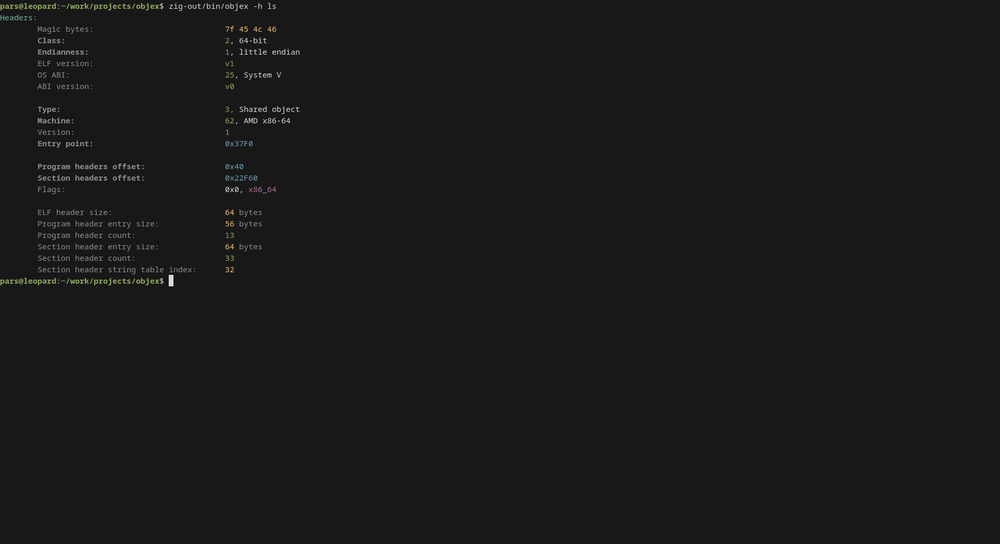
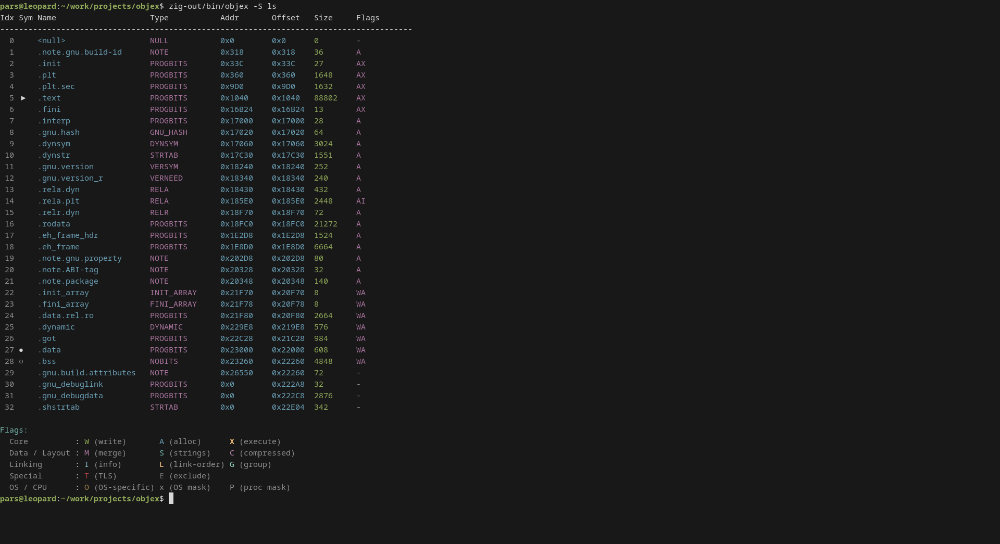
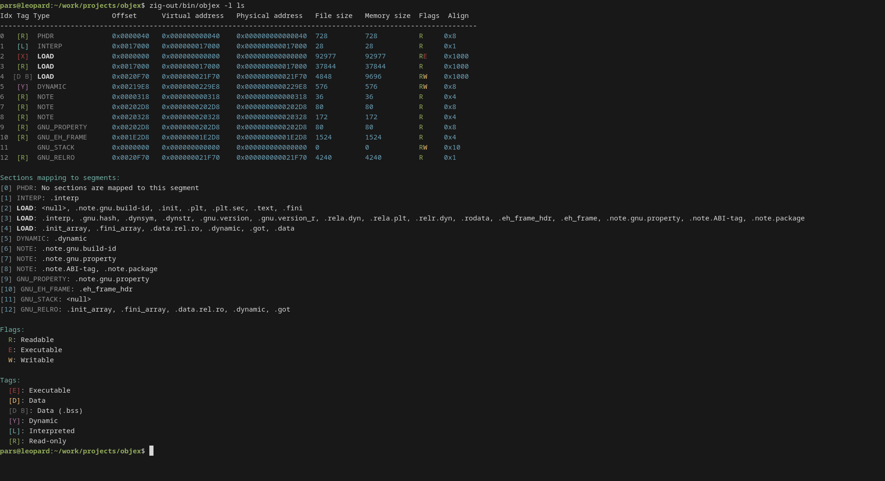
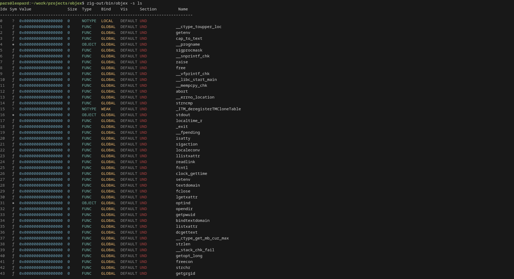
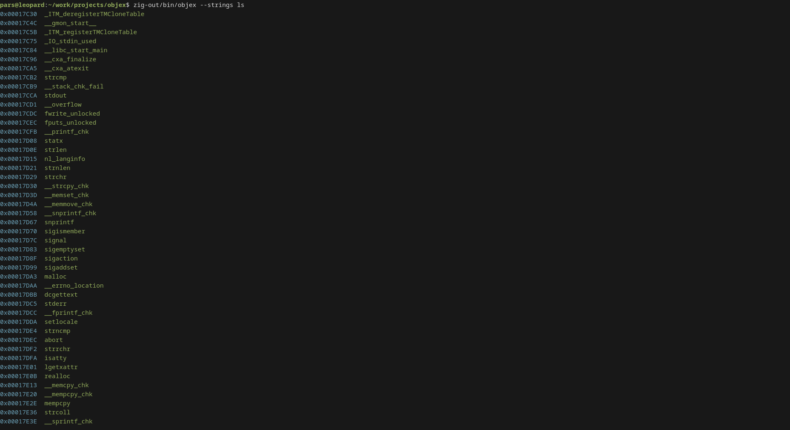

# objex


Objex is a lightweight CLI tool for parsing and visualizing ELF binaries written in Zig.

## Table of Contents

* [Quick Start](#quick-start-)
* [Installation](#installation-)
    + [Installation from source](#from-source)
    + [Installation via releases](#installation-via-releases)
* [Features](#features-)
* [Usage](#usage-)
    + [Examples](#examples)
* [Screenshots](#screenshots)
* [Why objex?](#why-objex)
* [License](#license)

## Quick Start ⚡

Clone, build and run:
```bash
git clone https://github.com/parssarica/objex.git
cd objex
zig build -Doptimize=ReleaseFast
./zig-out/bin/objex -a /bin/ls
```

(Optional) Move the binary to your PATH:

```bash
sudo cp zig-out/bin/objex /usr/local/bin
``` 

## Installation 🔧

### From Source

```bash
git clone https://github.com/parssarica/objex.git
cd objex
zig build -Doptimize=ReleaseFast
sudo cp zig-out/bin/objex /usr/local/bin # optional
```

### Installation via releases
Download the latest release from GitHub, then:
```bash
unzip objex-*.zip
sudo cp objex /usr/local/bin # optional
```

## Features ✨
- ELF header parsing
- Section parsing
- Program header (segment) parsing
- Symbol table parsing
- String extraction
- Clean, colorful and readable output

## Usage 🚀

Basic syntax:
```bash
objex <options> <file>
```

| Flag               | Long Option         | Description                  |
|--------------------|---------------------|------------------------------|
| `-a`               | `--all`             | Show all available information |
| `-h`               | `--headers`         | Show ELF headers               |
| `-S`               | `--sections`        | Show section headers           |
| `-l`               | `--program-headers` | Show program headers (segments) |
| `-s`               | `--symbols`         | Show symbol table            |
|                    | `--strings`         | Extract and display strings  |

### Examples

```bash
objex -a /bin/ls
objex --sections ./a.out
objex --symbols --strings ./binary
```

## Screenshots







## Why objex?

Tools like readelf and objdump are powerful, but their output is designed for traditional terminals and can be difficult to scan quickly.

**objex** focuses on:

- **Readability first** -- structured and visually clear output
- **Modern CLI experience** -- sensible defaults and clean formatting
- **Fast navigation** -- quickly find the information you care about
- **Developer-friendly design** -- built for day-to-day use, not just completeness

Instead of overwhelming you with raw data, objex presents ELF internals in a way that is easier to explore and understand.


## License
This project is licensed under the BSD license. See the [LICENSE](LICENSE) file for details.
